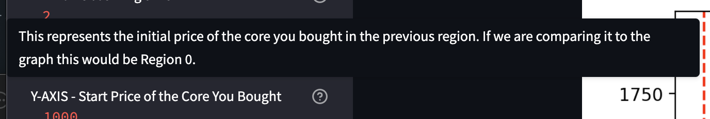
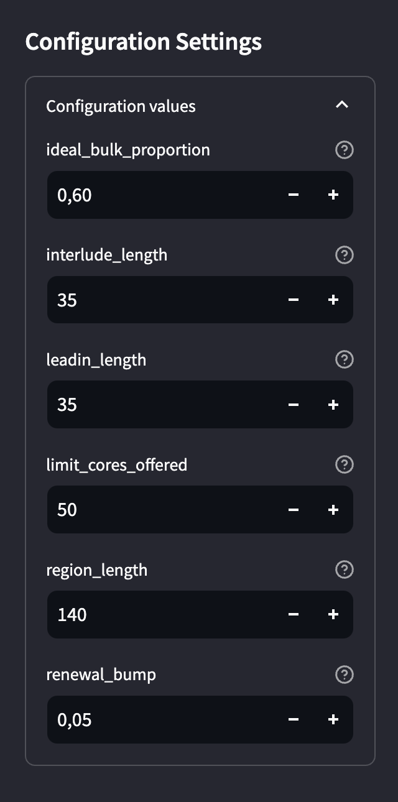
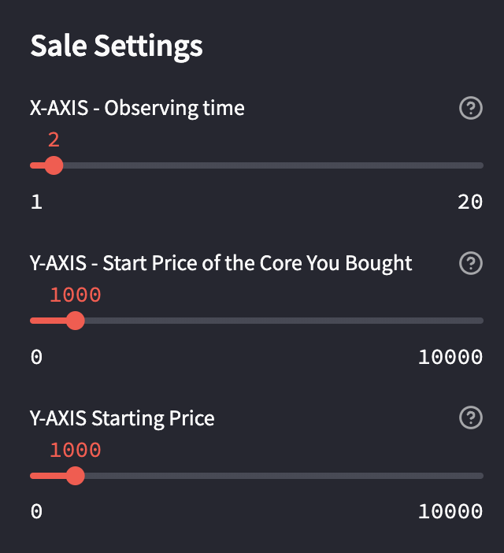
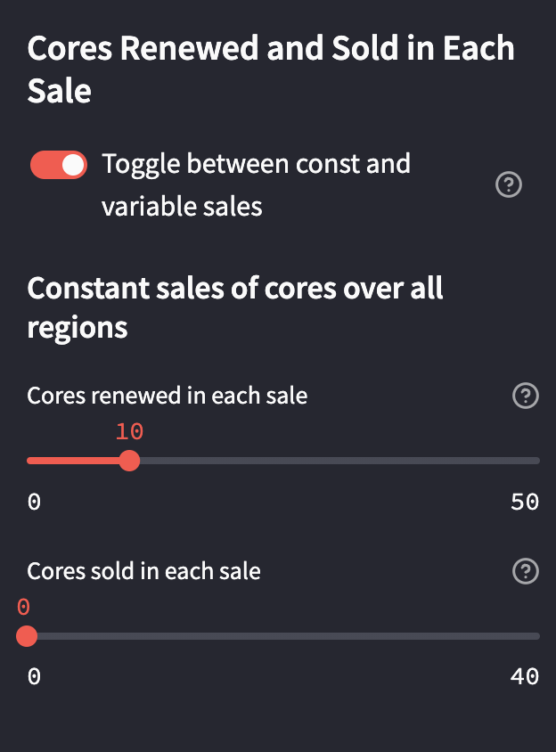
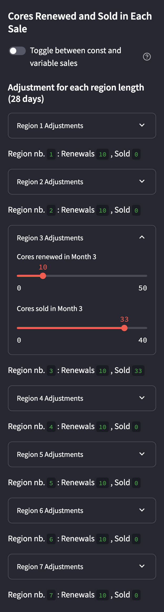
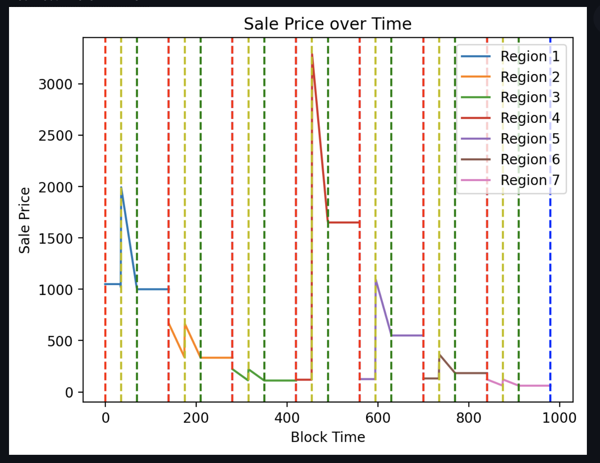
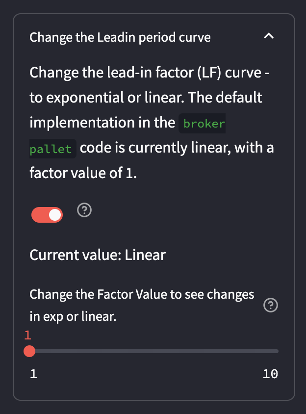

# User Guide: Coretime Price Simulator

## Introduction

This guide will walk you through the features and functionalities of the simulator, ensuring you make the most out of this application. For a video guide check out this youtube video:

<iframe width="560" height="315" src="https://www.youtube.com/embed/7y8Tad7WfdU?si=QWtblXUL38VZVqby" title="YouTube video player" frameborder="0" allow="accelerometer; autoplay; clipboard-write; encrypted-media; gyroscope; picture-in-picture; web-share" allowfullscreen></iframe>

## Visualization

The Coretime Price Simulator provides a graphical representation of sale prices over time based on your input settings. Key periods, such as `Interlude`, `Leadin`, and `Region`, are distinctly marked on the graph for clarity.

## Sidebar: Customizing Your Simulation

The sidebar is your control panel for customizing the simulation. It contains various settings that directly influence the graph's output.

Hovering over the `?` icon next to each setting reveals additional information.

### Configuration Settings

In the 'Configuration Settings' section, sliders allow you to adjust various parameters that influence Coretime pricing:

1. **Ideal Bulk Proportion**: Sets the target ratio of cores for stable pricing. Prices rise if `cores_sold` exceed this proportion.
2. **Interlude Length**: Defines the renewal period, giving precedence to existing tasks.
3. **Leadin Length**: Duration of dynamic pricing phase where prices gradually decrease to the sale price, reflecting market demand.
4. **Limit Cores Offered**: Maximum number of cores available per sale, crucial for maintaining market balance.
5. **Region Length**: Time span of core allocation for each sale, indicative of the bulk period in Agile Coretime.
6. **Renewal Bump**: Incremental price increase for renewals, facilitating long-term budgeting.

### Sale Settings

Adjust the sale settings to specify the time frame and initial pricing for your simulation.

1. **Observation Time**: Use the 'X-AXIS - Observing time' slider to select the number of regions to observe.
2. **Initial Core Pricing**: Determine starting prices for cores with the 'Y-AXIS' sliders.

### Core Sales Configuration

Customize your sale model:

- **Constant Sales**: Set a uniform number of cores renewed and sold in each sale.
- **Variable Sales**: Modify the number of cores renewed and sold for each region, reflecting a dynamic market model.

For constant sales:

For variable sales:

The graph for variable sales that coresponds to above settings will look like this:

#### Additional Feature: Leadin Period Curve

A unique feature of our simulator is the ability to modify the Leadin period curve. This lets you explore how linear or exponential pricing models impact Coretime prices.

