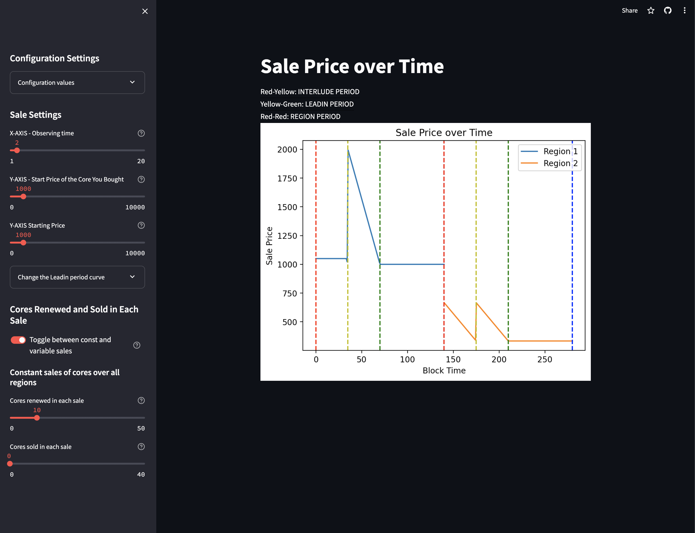

# 🍭 Coretime Sale Price Simulator

Welcome to the Coretime Sale Price Simulator 🎉 🎉 🎉! This interactive tool allows you to simulate and visualize the sale price of Lastic cores over time based on various parameters. 

## Accessing the Application

Visit [lastic.streamlit.app](https://lastic.streamlit.app/) to start using the application.

## Features

The Lastic Sale Price Simulator offers the following features:

- **Interactive sliders** to adjust sale parameters.
- **Real-time graph visualization** of sale prices over time.
- Options for **configuring core sales**, including constant and variable sales settings.
- Ability to observe **sale price changes** over different regions and time periods.



## A few explainations before diving deeper
Before you start diving deeper into how to use the tool here are a few key things to know:

### Overview of Agile Coretime on Polkadot

Agile Coretime introduces a new, flexible method for allocating "Coretime" or "block space" within the Polkadot Network. This system shifts from a fixed, long-term allocation model to a dynamic, sale-based approach, providing more versatility and efficiency in resource utilization.

### Key Concepts

- **Polkadot Ubiquitous Computer (Polkadot UC)**: Represents the collective computing resource provided by the Polkadot Network. It's a resilient, multi-core virtual machine that runs WebAssembly.

- **Coretime**: Analogous to block space, Coretime is the time during which a Polkadot core is dedicated to performing a specific task. It's a measure of computational resource allocation within the network.

Instead of fixed, long-term allocations (like the previous parachain slot auctions), Coretime is periodically sold in two formats:

1. **Bulk Coretime**: Scheduled and sold in advance for a set period. It allows for planning and stable allocation of resources.
   
2. **Instantaneous Coretime**: Sold on a block-by-block basis, catering to immediate, short-term needs.

This dual system aims to balance long-term planning with the flexibility of immediate resource allocation. Since this price simulator only models Bulk Coretime pricing, we are going to go a bit deeper into that.

#### Region: The Tradable Unit of Coretime
- A **Region** is a defined period of Coretime with a specific regularity and core association, forming the basis of the sale and allocation process.
- Regions can be traded, split, or pooled, providing flexibility in how Coretime is managed and utilized.


### Simplified Explanation of Bulk Pricing in Polkadot's Agile Coretime

The pricing of Bulk Coretime in Polkadot's network follows a dynamic model that adapts based on several factors. This section simplifies the understanding of this pricing mechanism.

#### Key Components of Bulk Price Setting

- **`OLD_PRICE`**: Price of Coretime in the previous sale.
- **`BULK_TARGET`**: Ideal number of cores aimed to be sold or renewed.
- **`BULK_LIMIT`**: Maximum number of cores available for sale or renewal.
- **`CORES_SOLD`**: Actual number of cores sold or renewed in the last sale.
- **`SELLOUT_PRICE`**: Price at which the last Bulk Coretime was sold, affecting the next sale price.

#### How Prices Change

- **Increase and Decrease**: The price of Coretime increases as sales approach `BULK_LIMIT` and decreases as they move closer to zero.
- **Stability at Target**: If the number of cores sold equals the `BULK_TARGET`, the price is expected to stay stable.
- **Edge Case Handling**: In situations where no new sales occur but renewals exceed the target, the price remains unchanged.

#### Example Formula

An example formula to demonstrate this dynamic pricing is:

```
Calculate EFFECTIVE_PRICE based on `SELLOUT_PRICE` and `CORES_SOLD`.
NEW_PRICE is determined by comparing `CORES_SOLD` with `BULK_TARGET` and `BULK_LIMIT`.
```

#### Pricing During the Leadin Period

During the initial phase of a sale, known as the Leadin Period, the price of Coretime starts higher and gradually reduces to the Sale Price by the end of the period.

- **Price Reduction**: The price decreases linearly from twice the Sale Price at the start of the Leadin Period to the Sale Price at its end.
- **Formula**: `PRICE := SALE_PRICE * (2 - ((Current Time - LEADIN_BEGIN) / LEADIN_PERIOD))`

#### Parameters Influencing Pricing

Some parameters influencing this pricing model include:

| Parameter           | Value                  | Type       |
|---------------------|------------------------|------------|
| `BULK_PERIOD`       | `28 * DAYS`            | Specified  |
| `INTERLUDE_PERIOD`  | `7 * DAYS`             | Specified  |
| `LEADIN_PERIOD`     | `7 * DAYS`             | Specified  |
| `TIMESLICE`         | `8 * MINUTES`          | Specified  |
| `BULK_TARGET`       | `30`                   | Suggested  |
| `BULK_LIMIT`        | `45`                   | Suggested  |
| `RENEWAL_PRICE_CAP` | `Perbill::from_percent(2)` | Suggested  |

This simplified explanation aims to provide a clearer understanding of how Bulk Coretime pricing operates within the Polkadot network, making it easier to engage with the Coretime Sale Price Simulator.
