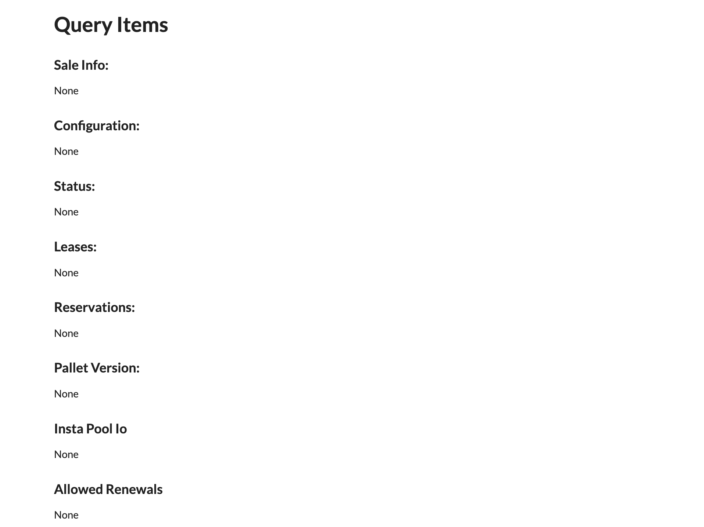
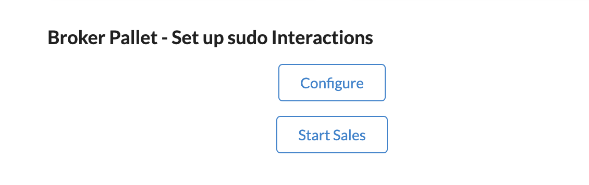
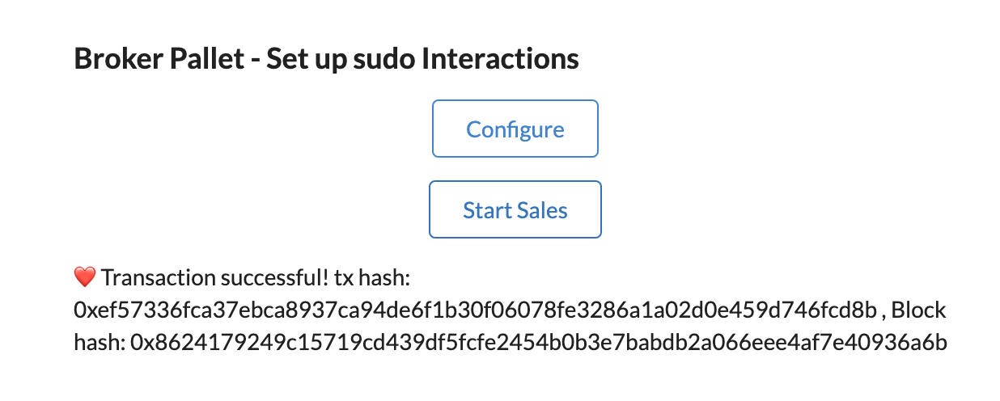
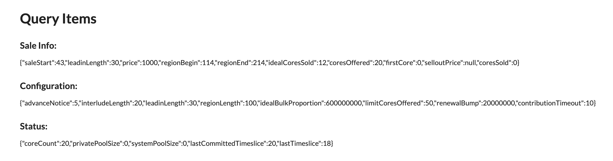
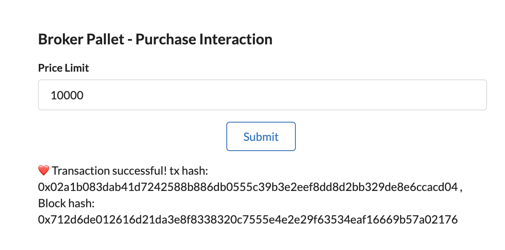
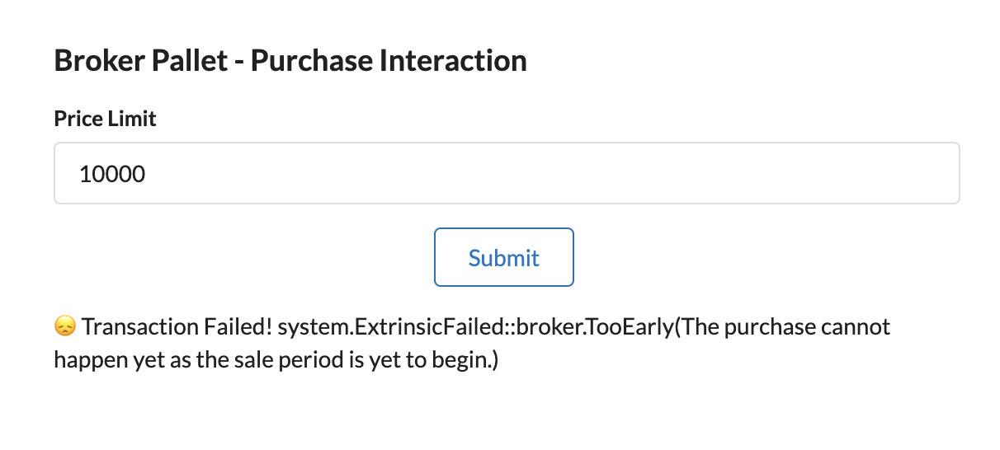
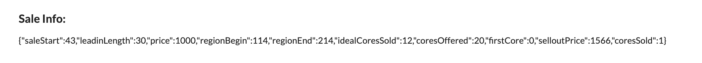
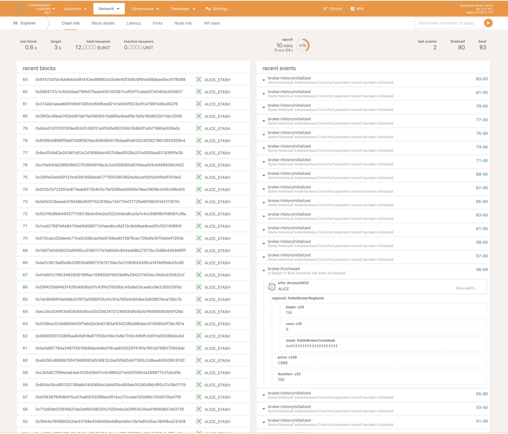
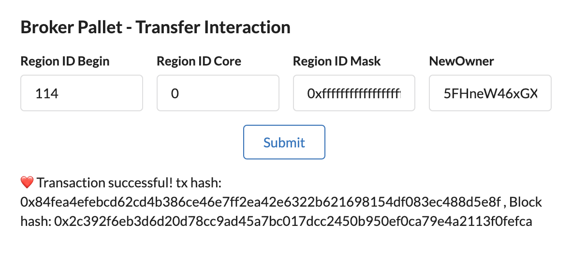
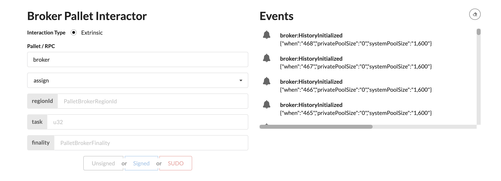

# Interacting with LasticUI/substrate-interact

This section guides you through the process of interacting with the Coretime chain using the `LasticUI/substrate-interact` interface.

## Basic Interaction

Once the Coretime chain is operational, you can access its features at **[http://localhost:8000/substrate-front-end-template]()**.

### Initial View

Upon accessing the interface, you'll see a display similar to the following image. Initially, no data will be shown under the various query fields, as the Coretime chain needs to be configured first.

### Configuring the Coretime Chain

1. **Start the Configuration**:

   Click the 'Configure' button to initialize the configuration of the Coretime chain.

   

2. **Confirmation of Successful Transaction**:

   Once the configuration is successful, you'll see a confirmation message: "❤️ Transaction successful...".

   

### Initiating the Sales Process

1. **Starting Sales**:

   Next, click the `Start Sales` button. This triggers a command to prepare the Coretime chain for the sales process.

2. **Sales Information**:

   Below the 'Start Sales' button, you'll find details such as the block number at which the sale starts and the current count of cores sold. Initially, this count will be zero.

   

### Making a Purchase

1. **Purchase a Core**:

   Try buying a core by setting a price limit (e.g., 10000) and submitting the transaction.

2. **Transaction Results**:

   After a successful transaction, the number of cores sold will update under the query items.

   

   If you encounter a transaction failure message like "😔 Transaction Failed! `system.ExtrinsicFailed::broker.TooEarly`...", it indicates that the purchase attempt was made before the start of the sales period. Refer to the **Sale Info** section under **Query Items** to check the 'Sale Start' block time.

   

3. **Successful Sale Verification**:

   A successful sale will be reflected by an increase in the `coresCount`.

   

## Advanced Interactions

### Transferring Purchased Cores

1. **Accessing Polkadot.js Interface**:

   To transfer the core you've purchased, navigate to [`Polkadot.js` under Development > localnode](https://polkadot.js.org/apps/?rpc=ws%3A%2F%2F127.0.0.1%3A9944#/explorer). This link will direct you to the Transfer/Extrinsics section.

2. **Locating the Purchase Event**:

   In the 'Recent Events' section, look for an event labeled `broker.Purchased`. If no such event is found, consider purchasing another core. Key details like `begin`, `core`, and `mask` will be displayed.

   

3. **Transferring the Core**:

   Copy these details to the 'Broker pallet - Transfer Interaction' section and select a new public address to assign the core to a new owner.

   

### Other Interactions
Other extrinsic interactions both `SUDO` and `SIGNED-TX` can be found under the `Broker Pallet Interactor` drop down button.
   
